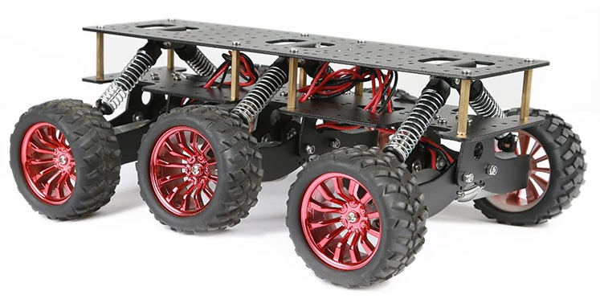

# SmallBot

SmallBot is a simple 6WD robot simulation based on ROS and Gazebo and a real robot based on a 6WD chasis.
The project is being developed and tested on ROS Melodic and Gazebo 9.0.0.

Robot movement and control simulation is based on Gazebo joint_state_publisher and DiffDrivePlugin6W plugins.

The real robot is being developed based on [YFRobot 6WD chasis](https://yfrobot.com/collections/robot-kits/products/wild-thumper-6wd-all-terrain-chassis-black)

The motors on the chasis were replaced with [DFROBOT metal DC geared motor w/encoder](https://www.dfrobot.com/product-1617.html)

NVIDIA Jetson Nano board is used as central processing unit, [Waveshare Uninterruptible Power Supply UPS Module for Jetson Nano](https://www.waveshare.com/product/ai/expansions/power-supply/ups-power-module-b.htm) is used to provide power to the robot.

Motors are controlled by 3 modified [Waveshare Motor Driver HAT for Raspberry boards](https://www.waveshare.com/product/raspberry-pi/hats/motors-relays/motor-driver-hat.htm). The modification includes removing MP1584 regulator and connecting VIN and 5V lines on the module. As I use 5V supply from Jetson board for motors, this regulator is not needed (and it doesn't work with supply voltage <6V).

[IMX219-83 Stereo Camera](https://www.waveshare.com/product/ai/cameras/binocular-cameras/imx219-83-stereo-camera.htm) connected to Jetson board is used to provide binocular vision to the robot.

[Slamtec RPLidar A1](https://www.slamtec.com/en/Lidar/A1) is used for scanning surroundings and navigation.

Temporarily I had to switch the hardware platform to Raspberry PI as I was not able to reach needed performance on reading motor encoders through Jetson GPIO even after switching from python to c++. This is still a subject for investigation.

## What's in the project

smallbot_base/ - base robot software, which intefaces controllers to hardware drivers  
smallbot_control/ - robot control, based on diffdrive controller  
smallbot_description/ - xacro/urdf robot model for RVIZ and Gazebo and rviz files for visualisations  
smallbot_driver/ - ROS nodes to interface with SmallBot hardware (motors and motor encoders)  
smallbot_gazebo/ - Gazebo robot simulation

## Working with robot

Be sure you have ros-melodic-hector-gazebo package installed as SmallBot uses plugins from this package

``sudo apt-get install ros-melodic-hector-gazebo``

Checkout the repository into src directory of ros workspace

``git clone https://github.com/belovictor/SmallBot.git``

Build project

``catkin_make``

Run environment setup

``. devel/setup.bash``

### Start model visualization

``roslaunch smallbot_description display_model.launch``

### Start Gazebo simulation

First launch Gazebo simulation

``roslaunch smallbot_gazebo smallbot_world.launch``

Then start control

``rqt``

Open robot control plugin from menu - Plugins -> Robot tools -> Robot steering - and set topic to /cmd_vel  
Change linear and angular velocity to make robot moving in Gazebo simulation

Lidar readings can be visualized in RVIZ

### Operating the real robot

Launch all nodes on robot

``roslaunch smallbot_description bringup.launch``

Then launch RVIZ visualisation to monitor robot movements

``roslaunch smallbot_description display_movement.launch``

Finally to control robot movements

``rqt``

Open robot control plugin from menu - Plugins -> Robot tools -> Robot steering - and set topic to /smallbot_drive_controller/cmd_vel  
Change linear and angular velocity to make robot moving in Gazebo simulation

### Real robot construction

The real robot is work in progress, I will publish 3D models of it's parts when the design is finished

### References

First of all, much of the code in this project is based on [Amperka Abot ROS robot](https://github.com/amperka/abot/) and their [series of posts on how to build your own robot with ROS](https://amperka.ru/blogs/projects/abot-robot-part-1)

